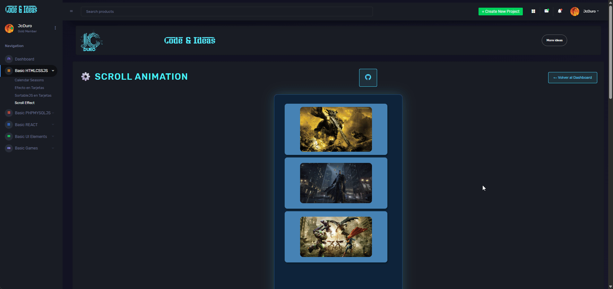

# Gallery Scroll – JcDuro Dashboard

---

## Descripción

Módulo de galería con scroll dentro del JcDuro DashBoard, pensado para mostrar tarjetas o bloques de contenido en una lista vertical con altura limitada y barra de desplazamiento, manteniendo el estilo oscuro/neon del resto del panel. 

## ✨ Características

- Contenedor principal con altura fija que muestra solo algunos ítems y permite hacer scroll para ver el resto. 
- Diseño compatible con el dashboard JcDuro, integrable como sección adicional de proyectos o registros.   
- Estructura HTML sencilla (lista de elementos) que se alimenta desde PHP/MySQL o datos estáticos, según necesidad del proyecto.
  
---

🖼️ Vista previa



--- 

✨ Pruebalo Online

[Gallery_Scroll](https://jcduro.bexartideas.com/proyectos/dashjc/gallery_scroll/gallery_scroll.php)

--- 

## 📁 Estructura del proyecto

  ```bash
        gallery_scroll/
        ├── gallery_scroll.html      # Vista principal del módulo con el contenedor y la lista scrollable
        ├── css/
        │   └── gallscroll.css  # Estilos del scroll, tarjetas y layout
        ├── js/
        │   └── gallcroll.js   # Lógica JS opcional para interacción extra
        └── assets/
            └── img/             # Imágenes o íconos usados en la galería (opcional)

```

📊 Lenguajes y Herramientas

[](https://skillicons.dev)

---

## 🚀 Cómo Usarlo

1. Copia la carpeta `gallery_scroll` dentro de la ruta de proyectos de tu dashboard JcDuro (por ejemplo `misproyectos/gallery_scroll/`).
2. Incluye `gallery_scroll.html` desde tu layout principal del panel, en la sección donde quieras mostrar la galería. 
3. Asegúrate de enlazar correctamente el CSS y JS de este módulo (rutas relativas según tu estructura).
4. Si usas datos dinámicos, conecta `gallery_scroll.html` a tu base de datos y ajusta el bucle que pinta las tarjetas.
5. Cambia las imagenes a tu gusto
